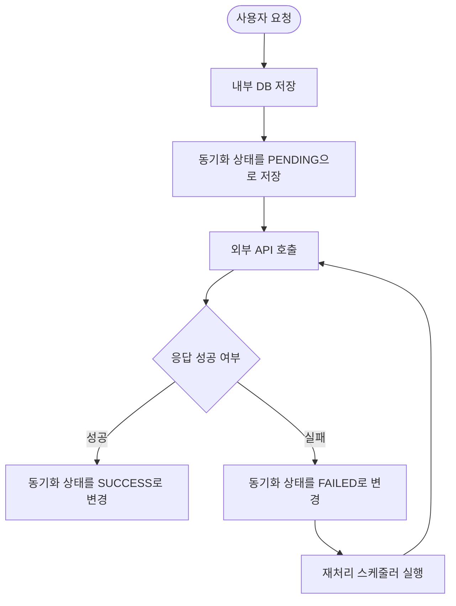

# 시나리오2 - 컬럼 추가 방식

원본 파일: 시나리오2 - 컬럼 추가 방식.mmd

```mermaid
flowchart TD
    시작([사용자 요청]) --> 디비저장[내부 DB 저장]
    디비저장 --> 대기상태[동기화 상태를 PENDING으로 저장]
    대기상태 --> 외부호출[외부 API 호출]
    외부호출 --> 성공여부{응답 성공 여부}

    성공여부 -->|성공| 성공상태[동기화 상태를 SUCCESS로 변경]
    성공여부 -->|실패| 실패상태[동기화 상태를 FAILED로 변경]
    실패상태 --> 재처리스케줄러[재처리 스케줄러 실행]
    재처리스케줄러 --> 외부호출
```

