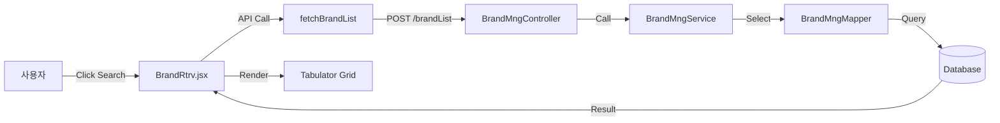

# 그리드 CRUD 프로세스 구현 요약

본 문서는 **브랜드 데이터(BrandRtrv)**를 기준으로, 그리드 기반의 CRUD(Create, Read, Update, Delete)가 전체 시스템에서 어떤 프로세스로 구현되는지 정리한 문서입니다.

## 1. 아키텍처 개요
- **Frontend**: React, Tabulator Grid(라이브러리), Axios(통신)
- **Backend**: Spring Boot, MyBatis(데이터 매핑)
- **Database**: PostgreSQL (추정, 쿼리 문법 기준)

## 2. 프로세스 흐름도

### 2.1 조회 (Read)
사용자가 화면에서 [조회] 버튼을 클릭했을 때의 흐름입니다.


### 2.2 저장 (Create & Update)
사용자가 화면에서 데이터를 수정하거나 신규 행을 추가한 후 [저장] 버튼을 클릭했을 때의 흐름입니다. **단일 트랜잭션**으로 처리됩니다.
```mermaid
graph LR
    User[사용자] -->|Click Save| UI[BrandRtrv.jsx]
    UI -->|Collect Data| Payload[Request JSON]
    Payload -->|POST /saveBrand| Server[BrandMngController]
    Server -->|Call| Service[BrandMngService]
    Service -->|@Transactional| Loop{Loop List}
    Loop -->|Status=C| Insert[Insert Query]
    Loop -->|Status=U| Update[Update Query]
    Loop -->|Status=D| Delete[Delete Query]
    Insert --> DB[(Database)]
    Update --> DB
    Delete --> DB
```

## 3. 상세 구현 로직

### 3.1 프론트엔드 (데이터 수집)
- **조회**: 검색 조건을 객체로 만들어 API에 전달합니다. 반환된 배열 데이터를 `setState`를 통해 그리드에 주입합니다.
- **편집**: Tabulator 그리드는 사용자의 입력을 감지하여 수정된 셀을 표시합니다.
- **신규**: 버튼 클릭 시 로컬 State 배열에 빈 객체를 추가(`status` 또는 `_flag` 초기값 설정)하여 그리드에 즉시 반영합니다.
- **저장 전송**: 그리드의 전체 데이터(또는 변경된 데이터)를 배열 형태로 백엔드에 전송합니다. 이때 각 행이 신규인지 수정인지 구분할 수 있는 상태값(`status`, `rowStatus` 등)이 포함되어야 합니다.

### 3.2 백엔드 (비즈니스 로직)
- **데이터 수신**: `List<DTO>` 형태 또는 `DTO` 내부의 리스트 형태로 데이터를 받습니다.
- **트랜잭션 처리**: Service 계층에서 `@Transactional` 어노테이션을 사용하여 전체 일괄 처리가 성공하거나, 실패 시 전체 롤백되도록 보장합니다.
- **분기 처리**: 리스트를 반복문(Loop)으로 순회하며, 각 아이템의 상태 코드(`status`)를 확인합니다.
    - **C (Create)**: `Mapper.insertBrand` 호출
    - **U (Update)**: `Mapper.updateBrand` 호출
    - **D (Delete)**: `Mapper.deleteBrand` 호출 (현재 소스에는 미구현 상태, 추가 개발 필요)

## 4. 핵심 포인트
1. **일괄 처리**: 건건이 API를 호출하지 않고, 변경된 리스트를 한 번에 서버로 보내 처리하여 네트워크 비용을 줄이고 트랜잭션 정합성을 유지합니다.
2. **상태 기반 로직**: DB에 저장하기 전, 데이터가 신규인지 수정인지 판단하는 로직이 **Service 계층**에 집중되어 있습니다.
