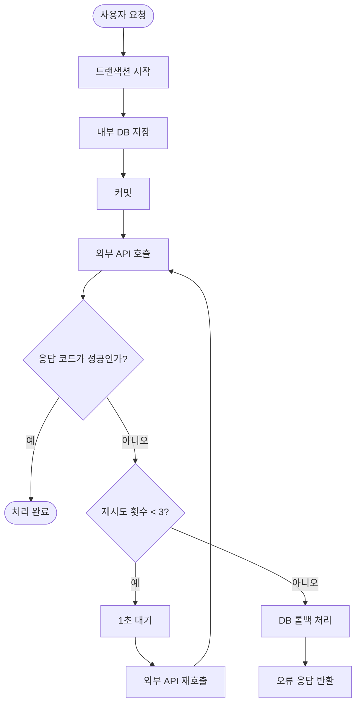

# 시나리오1 - 예외 처리 방식

원본 파일: 시나리오1 - 예외 처리 방식.mmd

```mermaid
flowchart TD
    시작([사용자 요청]) --> 트랜잭션시작[트랜잭션 시작]
    트랜잭션시작 --> 디비저장[내부 DB 저장]
    디비저장 --> 커밋[커밋]
    커밋 --> 외부호출[외부 API 호출]
    외부호출 --> 성공여부{응답 코드가 성공인가?}

    성공여부 -->|예| 완료([처리 완료])
    성공여부 -->|아니오| 재시도판단{재시도 횟수 < 3?}
    재시도판단 -->|예| 대기[1초 대기]
    대기 --> 재호출[외부 API 재호출]
    재호출 --> 외부호출
    재시도판단 -->|아니오| 롤백[DB 롤백 처리]
    롤백 --> 오류응답[오류 응답 반환]
```

